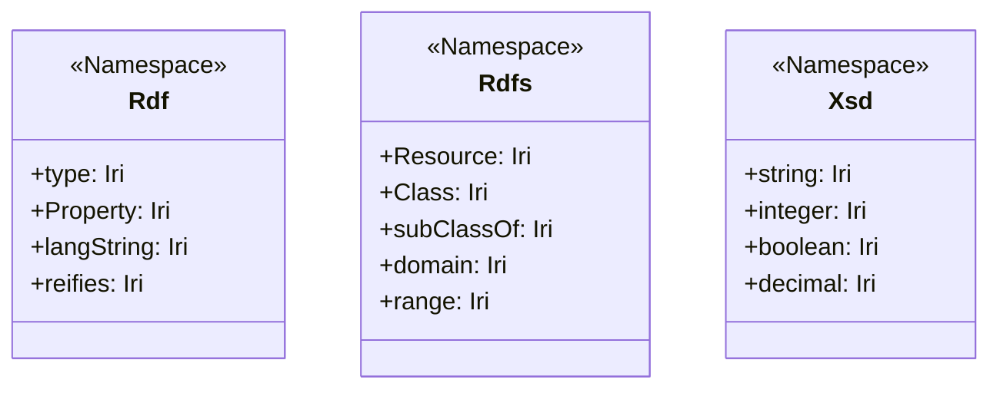

# Design Document: RDF Vocabulary Constants

## Overview
This document outlines the design for replacing manual string representations of common RDF, RDFS, and XSD IRIs with structured, type-safe constants. This refactor aims to improve developer experience, reduce errors from typos, and provide a central location for standard vocabulary definitions.

## Goal
The primary goal is to provide a clean, idiomatic Dart interface for accessing common RDF-related IRIs:
- `rdf:type`, `rdf:Property`, `rdf:langString`, etc.
- `rdfs:subClassOf`, `rdfs:domain`, `rdfs:range`, etc.
- `xsd:string`, `xsd:integer`, `xsd:boolean`, etc.

## Analysis
Currently, the codebase uses `Iri('...')` with literal strings in many places (e.g., `rdfs_reasoner.dart`, `turtle_encoder.dart`, `literal.dart`). This leads to redundancy and is prone to errors.

### Constraints
1.  **Type Safety:** Constants should be of type `Iri`.
2.  **Grouping:** Constants should be logically grouped by namespace.
3.  **Idiomatic Dart:** While classes with only static members are generally discouraged, they are a common pattern for "Namespace" groupings in Dart libraries (similar to `Colors` or `Icons`). Alternatively, top-level constants in a library can be used with prefixed imports.
4.  **Performance:** Constants should be `const` expressions to allow efficient reuse and usage in other `const` contexts (where applicable).

## Proposed Design

### 1. File Structure
We will create a new directory `lib/src/vocabulary/` containing separate files for each namespace:
- `lib/src/vocabulary/rdf.dart`
- `lib/src/vocabulary/rdfs.dart`
- `lib/src/vocabulary/xsd.dart`
- `lib/src/vocabulary/vocabulary.dart` (Central export and combined access)

### 2. Implementation Pattern
We will use classes with a private constructor to prevent instantiation. Each class will contain `static const Iri` members.

**Example: `lib/src/vocabulary/xsd.dart`**
```dart
import '../model/iri.dart';

/// XML Schema Datatypes (XSD) vocabulary.
class Xsd {
  Xsd._();

  static const String _base = 'http://www.w3.org/2001/XMLSchema#';

  static const string = Iri.fromUri(Uri(scheme: 'http', host: 'www.w3.org', path: '2001/XMLSchema', fragment: 'string'));
  static const integer = Iri.fromUri(Uri(scheme: 'http', host: 'www.w3.org', path: '2001/XMLSchema', fragment: 'integer'));
  static const boolean = Iri.fromUri(Uri(scheme: 'http', host: 'www.w3.org', path: '2001/XMLSchema', fragment: 'boolean'));
  // ... more types
}
```

*Note: Since `Iri.fromUri` and `Uri` constructors are `const`, these can be true constants.*

### 3. Central Access
A central `vocabulary.dart` will export these for convenience.

```dart
export 'rdf.dart';
export 'rdfs.dart';
export 'xsd.dart';
```

### 4. Refactoring Strategy
I will systematically replace string literals with these constants in:
- `lib/src/reasoner/rdfs_reasoner.dart` (Large number of vocabulary constants here)
- `lib/src/codecs/turtle/turtle_encoder.dart`
- `lib/src/codecs/turtle/turtle_decoder.dart`
- `lib/src/codecs/n-triples/n_triples_encoder.dart`
- `lib/src/model/literal.dart`
- Tests and examples.

## Alternatives Considered

### Top-level constants in libraries
Instead of `Xsd.string`, we could have `const string = ...` in `xsd.dart` and require `import '.../xsd.dart' as xsd;`.
- **Pros:** More strictly follows `Effective Dart`.
- **Cons:** Requires users to remember to use `as xsd` to avoid name collisions (like `string` or `type`).
- **Decision:** The class-based "Namespace" pattern is more robust for a library where users might import multiple vocabularies.

### Enhanced Enums
- **Pros:** Built-in grouping.
- **Cons:** `Xsd.string` would be the enum value, requiring `Xsd.string.iri` to get the actual `Iri`. This adds verbosity.

## Diagrams



## References
- [Effective Dart: Design - Avoid classes with only static members](https://dart.dev/effective-dart/design#avoid-classes-with-only-static-members)
- [Dart URI class](https://api.dart.dev/stable/dart-core/Uri-class.html)
- [XSD Datatypes in RDF](https://www.w3.org/TR/rdf12-concepts/#section-Datatypes)